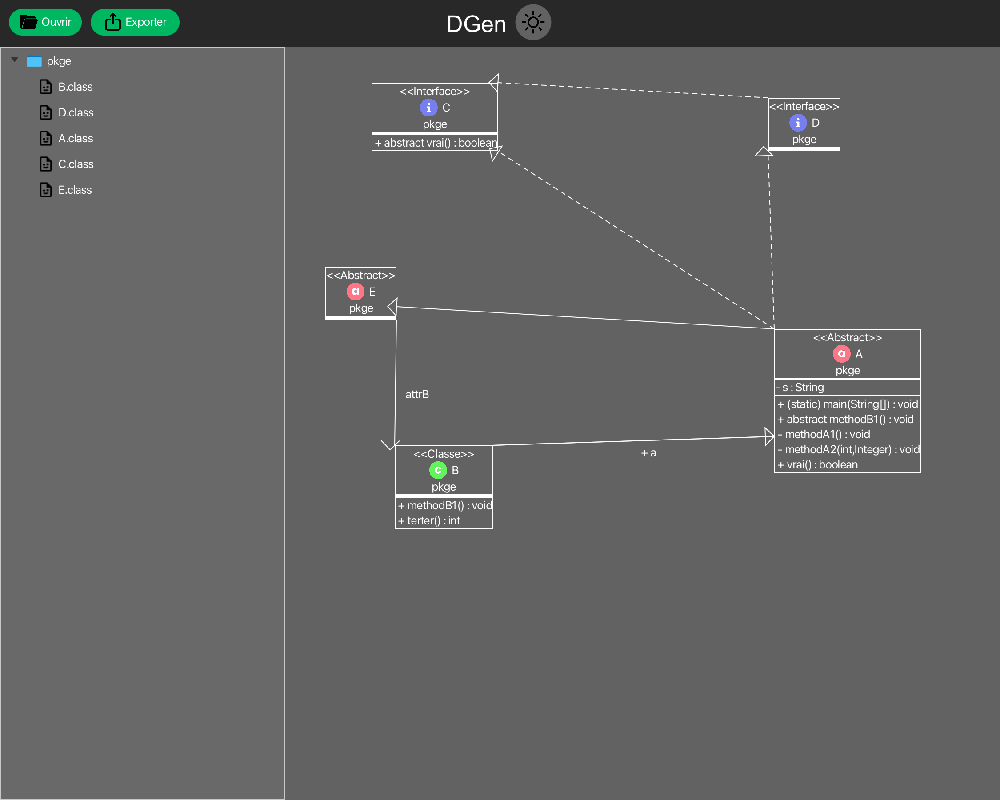

# DGen - SAÉ 3.1
## Introduction
DGen est un logiciel permettant de générer des diagrammes de classes en Java. Les fonctionnalités implémentées vont vous permettre de modifier les diagrammes générés, de les déplacers, de les supprimer.  
Grâce à un système de couleurs, vous aurez une facilité pour repérer les différents types de fichier (interface, classe, enum...).  
Nous avons aussi implémenté des fonctionnalités pour simplifier votre utilisation du logiciel, pour qu'il soit aussi pratique à utiliser que possible.  

## Installation
Pour installer le logiciel, il vous suffit de cloner le projet sur votre machine (HTTPS, SSH...). Il faut que vous disposiez au minimum de Java 18 pour pouvoir exécuter l'application  
Le projet utilise Maven pour gérer les dépendances, vous n'avez donc pas besoin de les installer manuellement. Pour consulter la liste de dépendances ou en ajouter, rendez-vous dans le fichier `pom.xml`.  

## Utilisation de l'application
Pour utiliser l'application, il vous suffit de lancer le fichier `Application.java` qui se trouve dans le package `com.example.darkmode`.  
A l'ouverture de l'application, vous aurez une fenêtre avec un menu en haut, une arborescence (vide) à droite et un espace de travail à droite. Pour ouvrir un répertoire, vous pouvez cliquer sur la bouton `Open`. Il est nécessaire que vous choissiez un répertoire avec des `.class`. 
Pour créer un diagramme, il vous suffit de déplacer un fichier en `.class` présent dans l'arborescence, dans l'espace de travail. Une rectangle contenant les informations de votre fichier sera affiché.  
Vous pouvez double-cliquer sur une classe, cela ouvrira un éditeur de texte, vous permettant de modifier le code .java de la classe sélectionnée directement depuis de l'espace de travai.  

## Auteurs et contributeurs
**Alexandre PERROT** - **Rémy KINZELIN** - **Jules HIRTZ** - **Lucas SIGNORELLI**

## Licence
La licence utilisée pour ce projet est la licence Apache. Vous pouvez la retrouver dans le fichier LICENSE.md